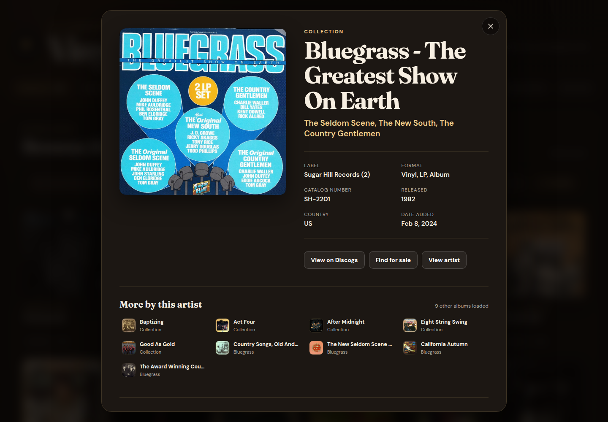

# Vinyl Viewer

Vinyl Viewer is a browser-based explorer for public [Discogs](https://www.discogs.com/) collections and wantlists. Enter a Discogs username to browse records, inspect collection analytics, open detailed release information, and create shareable collection views.

The application is built with plain HTML, CSS, and JavaScript. It has no build step, application server, database, or required package installation.

## Live Deployments

- **Netlify:** [www.vinylviewer.com](https://www.vinylviewer.com/)
- **GitHub Pages:** [jasonhand.github.io/vinyl-viewer](https://jasonhand.github.io/vinyl-viewer/)

Both deployments serve the same static application. The custom `www.vinylviewer.com` domain is hosted by Netlify, while the GitHub Pages URL provides a second deployment directly from the repository.

## Screenshots

### Collection

Browse, search, sort, and shuffle a user's public collection or wantlist.


### Analytics

Review collection totals, top genres, top artists, a release-year timeline, and artist distribution.


### Album Details

Open a record to see release metadata, external links, track information, Spotify availability, and more albums by the artist when that data is available.



## Features

- Browse a public Discogs collection and wantlist.
- Search by artist, album, or label.
- Sort records or shuffle the current shelf.
- View collection analytics for genres, artists, and release years.
- Open album details, track listings, Discogs marketplace links, artist sites, and group memberships.
- Play supported albums through an embedded Spotify player.
- Jump between related albums by the same artist.
- Share a filtered view, the complete collection, or a custom album selection.
- Disconnect and load a different Discogs username.
- Open the project information and developer support links from **Who built this?**
- Optionally browse public seller inventory through an experimental feature flag.

## How It Works

1. On startup, the app reads a previously connected Discogs username from `localStorage`. If none is stored, it loads the default collection.
2. `scripts/script.js` requests the user's public collection and wantlist from the Discogs API. Paginated responses are loaded 100 records at a time and requests are queued to reduce rate-limit errors.
3. Discogs responses are normalized into the record model used by the collection, wantlist, analytics, sharing, and modal views.
4. Analytics are calculated entirely in the browser from the loaded collection. No collection data is sent to an application server.
5. Opening an album requests additional release and artist metadata from Discogs. Spotify links are added from `data/spotify-albums.json` when a matching Discogs release ID exists.
6. Share links store their configuration in URL parameters. The recipient's browser loads the public collection from Discogs and applies the shared filter or album selection locally.

Because the application calls Discogs directly from the browser, only public collections and wantlists can be displayed. Discogs may occasionally rate-limit or temporarily reject a browser request; waiting briefly and retrying normally resolves it.

## Project Structure

```text
.
├── index.html                  Main application markup and templates
├── scripts/script.js           Discogs integration and application behavior
├── style/style.css             Responsive layout and visual design
├── data/spotify-albums.json    Discogs release ID to Spotify URL mapping
├── share/                      Share-link entry point and redirect
├── images/                     Application assets and README screenshots
└── _headers                    Netlify security headers
```

## Run Locally

Python 3 is the only prerequisite.

```bash
git clone https://github.com/jasonhand/vinyl-viewer.git
cd vinyl-viewer
python3 -m http.server 8001
```

Open [http://localhost:8001/](http://localhost:8001/) in a browser. Use `Ctrl+C` in the terminal to stop the server.

The app must be served over HTTP rather than opened directly as a `file://` URL because it loads local JSON and remote API data with `fetch()`.

For a quick JavaScript syntax check, run:

```bash
node --check scripts/script.js
```

## Experimental Seller Browsing

Seller browsing is hidden by default. Add `?seller=1` to any application URL to display the **For Sale** navigation option:

- Local: `http://localhost:8001/?seller=1`
- Netlify: `https://www.vinylviewer.com/?seller=1`
- GitHub Pages: `https://jasonhand.github.io/vinyl-viewer/?seller=1`

The seller view retrieves one page of 50 public listings at a time. Search and sorting apply to the currently loaded page, while the seller's complete inventory remains available through the Discogs profile link.

## Deployment

### Netlify

Deploy the repository root as the publish directory. No build command is required. Netlify processes `_headers`, which configures the Content Security Policy and other browser security headers for the application.

### GitHub Pages

Publish the repository from the branch and root directory configured in **Settings → Pages**. GitHub Pages serves the static files directly but does not apply Netlify's `_headers` configuration.

When changing CSS or JavaScript, allow for GitHub Pages caching or perform a hard refresh before comparing deployments.

## Data and Privacy

- Collection and wantlist information comes from the public Discogs API.
- `data/spotify-albums.json` contains only Discogs release IDs and Spotify album links.
- The selected username is stored locally in the browser.
- Share settings are encoded in the generated URL; the app does not maintain a share database.
- Raw Discogs exports, private notes, conversion scripts, and development schemas should not be committed or deployed.

The removed `data/input.csv` file remains in existing Git history. If it contained sensitive information, remove it from repository history before making the repository public.

## Monitoring

Get free monitoring for this project with [Datadog](https://www.datadoghq.com/dg/monitor/free-trial-b/?utm_source=jhand_demo).
