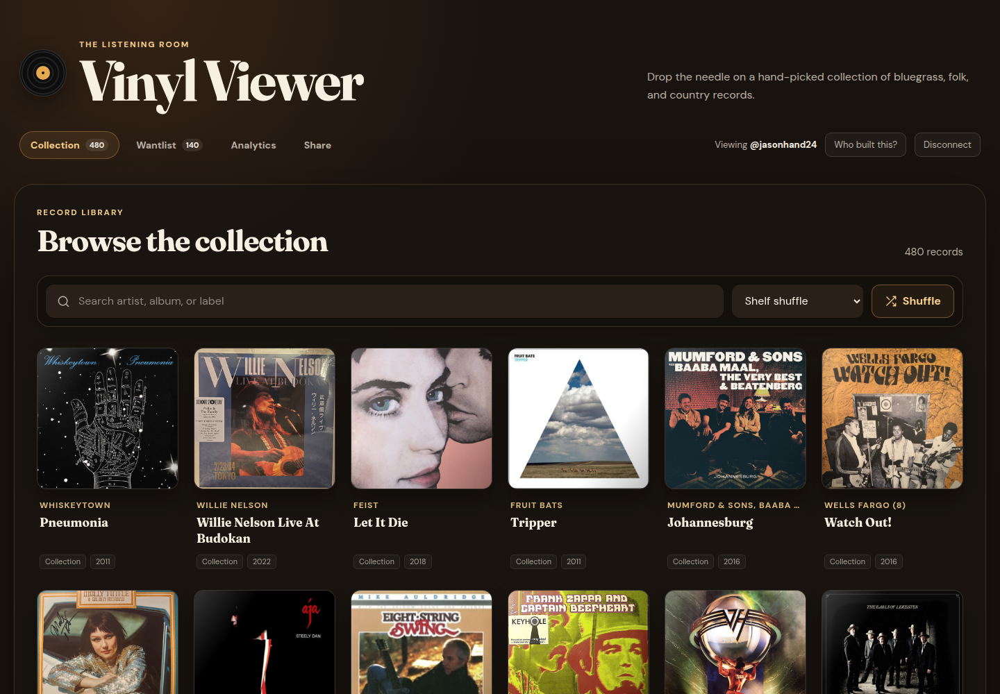
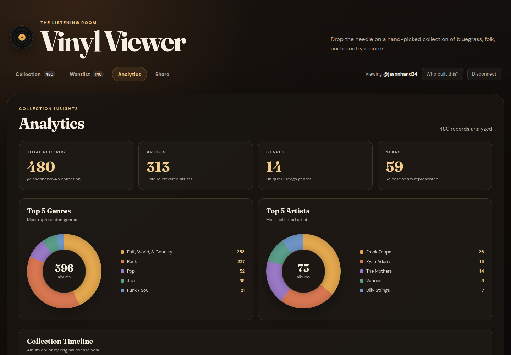

# Vinyl Viewer

## 📊 Monitoring

Get free monitoring for this project with [Datadog](https://www.datadoghq.com/dg/monitor/free-trial-b/?utm_source=jhand_demo)

HTML, Javascript, CSS, and JSON project to view my vinyl records 

[View the live GitHub Page](https://jasonhand.github.io/vinyl-viewer/)

## How to Use This Project

1. Fork this repository.
2. From the root directory, run `python -m http.server 8001` to start a web server on your local machine.
3. Browse to `http://localhost:8001/` in your browser to view the application.

>NOTE: Python must be installed locally.

## Where Does the Data Come From?

Collection and wantlist data comes from the public Discogs API. The
[`data/spotify-albums.json`](data/spotify-albums.json) file only maps Discogs
release IDs to Spotify album links that Discogs does not provide.

Do not publish raw Discogs exports or collection notes. Source CSV files,
conversion scripts, and development schemas are intentionally excluded from the
deployed project.

## Deployment Security

Deploy only over HTTPS. The [`_headers`](_headers) file configures a Content
Security Policy and other browser protections for hosts that support the
Cloudflare Pages or Netlify headers format. Configure the same headers in the
hosting dashboard when using a different platform.

The deleted `data/input.csv` file remains in existing Git history. If it ever
contained sensitive information, remove it from the repository history before
making the repository public.

## Experimental Seller Browsing

The **For Sale** view loads public Discogs seller inventory 50 listings at a
time. It intentionally uses server-side pagination instead of downloading a
seller's complete inventory, which may contain tens of thousands of listings.
Search and sorting apply to the currently loaded page; the full marketplace
inventory remains available through the seller's Discogs profile link.

Seller browsing is feature-flagged and hidden by default. Add `?seller=1` to the
application URL to display the **For Sale** navigation option, for example:
`http://localhost:8001/?seller=1`.
