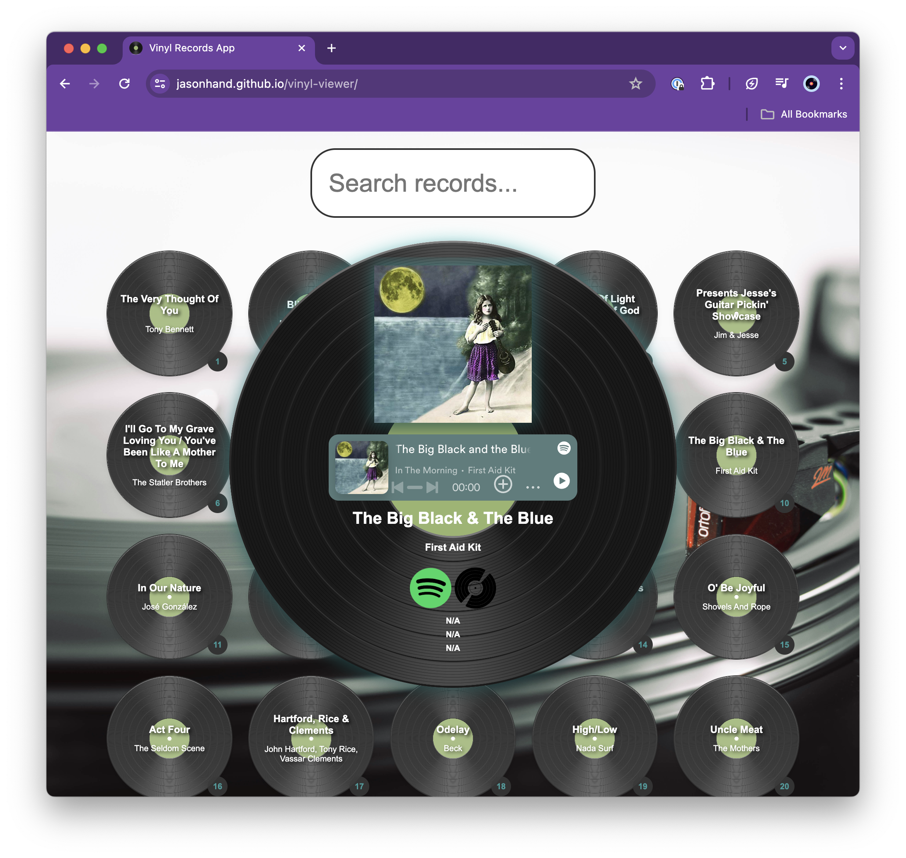

# Vinyl Viewer
HTML, Javascript, CSS, and JSON project to view my vinyl records 

[View the live GitHub Page](https://jasonhand.github.io/vinyl-viewer/)

## How to Use This Project

1. Fork this repository.
2. From the root directory, run `python -m http.server 8001` to start a web server on your local machine.
3. Browse to `http://localhost:8001/` in your browser to view the application.

>NOTE: Python must be installed locally.

## Where Does the Data Come From?

Information about the records is stored in the [data](data/output.json) file.